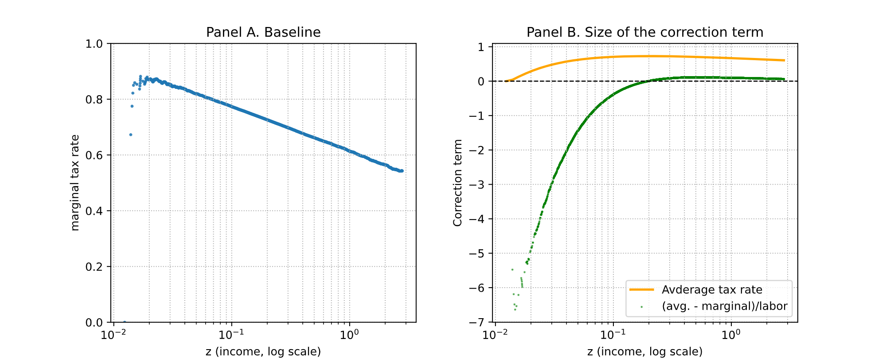
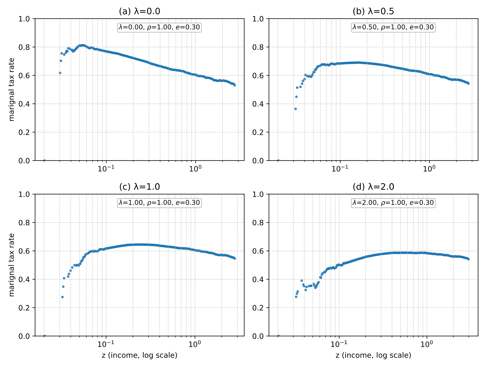
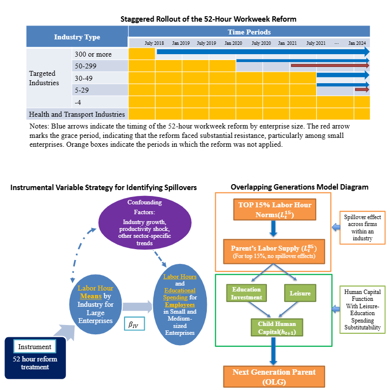

## **Pricing Redistribution: Optimal Income Taxation with a Fair-Pricing Constraint**  
*Discussion Draft in Progress (Oct 2025)*  
[**View on SSRN →**](https://papers.ssrn.com/sol3/papers.cfm?abstract_id=5589992)
 
This paper incorporates the no-arbitrage condition from financial economics into the design of optimal income taxation. Workers diversify wage risk through a variety of institutional and contractual arrangements, suggesting the presence of an implicit, complete market for wage-contingent claims under the veil of ignorance. I propose that a social planner’s redistribution scheme, which subsidizes or taxes portions of wages contingent on income level, can be interpreted analogously as an option contract uniquely tied one-to-one to each unit of labor supplied. 

For this linkage between labor and redistribution to hold and to prevent arbitrage, the planner must impose a fair-pricing constraint on the redistribution claim, analogous to that in financial economics, to ensure internal consistency within a complete-market equilibrium. Within this framework, I first analyze a two-bracket system that combines a wage subsidy and a proportional tax and then extend the analysis to a continuous schedule. 

The continuous formulation yields a correction term $$ \Theta_n $$, to the standard sufficient-statistics component $$ A_n $$. This correction increases optimal marginal tax rates in proportion to the wedge between average and marginal tax rates. 

The parameter $$ p $$ represents the marginal cost of public funds associated with the standard resource constraint, while $$ q $$ is a newly introduced multiplier on the fair-pricing constraint. The ratio $$ q/p $$ therefore captures the weight the social planner places on enforcing fair pricing relative to satisfying the conventional resource constraint.

**Main Result**

$$
\frac{\tau_n}{1-\tau_n}
=
\frac{A_n + \frac{q}{p}\Theta_n}{1 - \frac{q}{p}\Theta_n}.
$$

where

$$
\tilde g_m = \frac{G'(u_m)}{p} - \frac{q}{p\,\ell_m},
$$

$$
A_n =
\left(1+\frac{1}{e_n}\right)
\frac{\int_{n}^{\infty} (1-\tilde g_m)\ dF(m)}{n f(n)},
$$

$$
\Theta_n =
\frac{\ell_n v'(\ell_n) - u_n - v(\ell_n)}{n\ell_n^{2}}=\frac{1}{\ell_n}\big(t^{\text{avg}}_n-\tau_n\big).
$$

**Special Case: No Fair-Pricing Constraint**

When the fair-pricing constraint multiplier is set to zero $$ q = 0,$$ the formula reduces to Diamond (1998):

$$
\frac{\tau_n}{1-\tau_n}
=
\left(1+\frac{1}{e_n}\right)
\frac{\int_{n}^{\infty} (1-g_m)\, dF(m)}{n f(n)},
$$

with

$$
g_m = \frac{G'(u_m)}{p}.
$$

Simulations under a log-normal skill distribution show that enforcing the fair-pricing constraint flattens conventional marginal tax profiles, consistent with the empirically observed tendency toward flatter rate schedules in advanced economies.

### **Figures**

> **Figure 1. Degree of the correction term under the baseline scenario.** Panel A illustrates the standard result: marginal tax rates fall with income under a lognormal skill distribution. Panel B shows that when the fair-pricing constraint is excluded, the baseline estimate of the optimal marginal tax rate exhibits a correction term that is negative for low-income individuals and positive for high-income individuals. This implies that an optimal-taxation framework without the fair-pricing constraint may assign a heavier effective tax burden to low-income households than it should, particularly given that their labor supply is typically lower due to low wages.

> **Figure 2. Optimal marginal tax rate curves under different values of λ.** Simulated marginal tax schedules under varying values of λ. As λ increases from 0 to 2 (Panels B–D), the schedules become progressively flatter and eventually exhibit a mild inverted U-shape. This reflects how the fair-pricing constraint counteracts the downward slope predicted by the lognormal skill distribution in the standard Mirrlees framework.

---

## **Labor Hour Spillovers and Educational Spending: Evidence from Korea’s Workweek Reform**  
*Working Paper in Progress, Apr 2025*    

[View on SSRN →](https://papers.ssrn.com/sol3/papers.cfm?abstract_id=5214642)  

In 2018, the South Korean government implemented a 52-hour workweek limit to curb excessive working hours, initially targeting large enterprises with 300 or more employees. This policy provides a quasi-natural experiment introducing exogenous variation in labor hours among large-firm employees, which in turn influences workers in small and medium-sized enterprises (SMEs) to adjust their labor supply and household behavior in response to new industry-wide norms. I first estimate inter-firm spillover effects of labor-hour reductions and the crowd-out of educational spending through increased parental leisure, using instrumental-variable techniques with KLIPS panel data. Then, I develop an overlapping generations model to trace intergenerational mechanisms, showing that prolonged working hours driven by spillover effects constrain fertility choices and lead to excessive educational spending in the broader economy.

These findings show that overall, the absence of spillover pressure enables more efficient time allocation and supports family formation. They also highlight the central role of leisure–education substitutability in mitigating inequality and limiting intergenerational persistence. The capacity to convert parental time into child human capital is a critical channel through which policy can ease disparities in family resources and weaken the intergenerational transmission of socioeconomic disadvantage. 

---

# Publications in NABO

## Disaster Insurance Implementation and Financial Management Analysis  
**Solo-authored**.  _Included as the fifth chapter in NABO Comprehensive Analysis on Disaster and Safety Management, 2017_  

[View Translated Summary (PDF)](../files/Disaster_Insurance.pdf)  
[View Full Paper (In Korean)](https://nabo.go.kr/system/common/JSPservlet/download.jsp?fCode=33314430&fSHC=&fName=%EC%9E%AC%EB%82%9C%EC%95%88%EC%A0%84%EA%B4%80%EB%A6%AC+%ED%98%84%ED%99%A9%EA%B3%BC+%EC%A3%BC%EC%9A%94%EB%8C%80%EC%B1%85+%EB%B6%84%EC%84%9D+5.%EC%9E%AC%EB%82%9C%EB%B3%B4%ED%97%98+%EC%9A%B4%EC%98%81%EC%8B%A4%ED%83%9C+%EC%9E%AC%EC%A0%95%EC%9A%B4%EC%9A%A9+%EB%B6%84%EC%84%9D.pdf&fMime=application/pdf&fBid=19&flag=bluenet)  

> - Applied logistic regression to the Farm and Fishery Household Survey to assess distributional impacts of disaster insurance programs.
> - Conducted simulation analyses fitting exponential and mixed-gamma distributions to historical loss ratios to estimate fiscal losses under an actuarially benevolent national reinsurance scheme.

## Potential Risks from COVID-19 Responses and Liquidity Expansion  
**With Ick Jin (NABO) et al.**. _Published as a standalone report, National Assembly Budget Office, 2021._  

[View Translated Summary (PDF)](../files/Major_Countries.pdf)  
[View Full Paper (In Korean)](https://nabo.go.kr/system/common/JSPservlet/download.jsp?fCode=33316891&fSHC=&fName=2021%EB%85%84+%EC%A3%BC%EC%9A%94%EA%B5%AD+%EA%B2%BD%EC%A0%9C+%ED%98%84%ED%99%A9+%EB%B6%84%EC%84%9D.pdf&fMime=application/pdf&fBid=19&flag=bluenet)  

> - Led the comparative analysis of cross-country fiscal and liquidity responses, and directed the narrative design and ensured coherence.

## Employment Conditions in Small and Medium-Sized Cities  
**Solo-authored**. _NABO Industrial Trends & Issues, Vol. 3, No. 6, 2018, pp.25–37._  

[View Translated Summary (PDF)](../files/Employment_Conditions.pdf)  
[View Full Paper (In Korean)](https://nabo.go.kr/system/common/JSPservlet/download.jsp?fCode=33314781&fSHC=&fName=NABO+%EC%82%B0%EC%97%85%EB%8F%99%ED%96%A5+%26+%EC%9D%B4%EC%8A%88+%28%EC%A0%9C6%ED%98%B8%29.pdf&fMime=application/pdf&fBid=63&flag=bluenet)  

> - Applied linear probability and Heckman selection models using microdata from the Regional Employment Survey to analyze employment and wage disparities between population-growing and population-declining cities.

